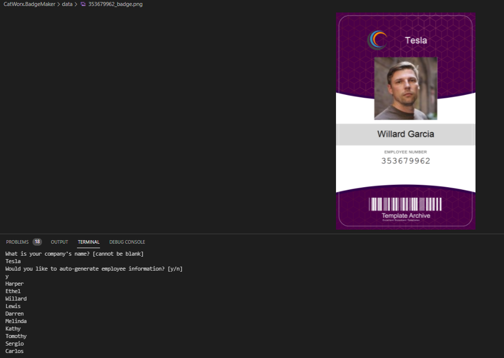
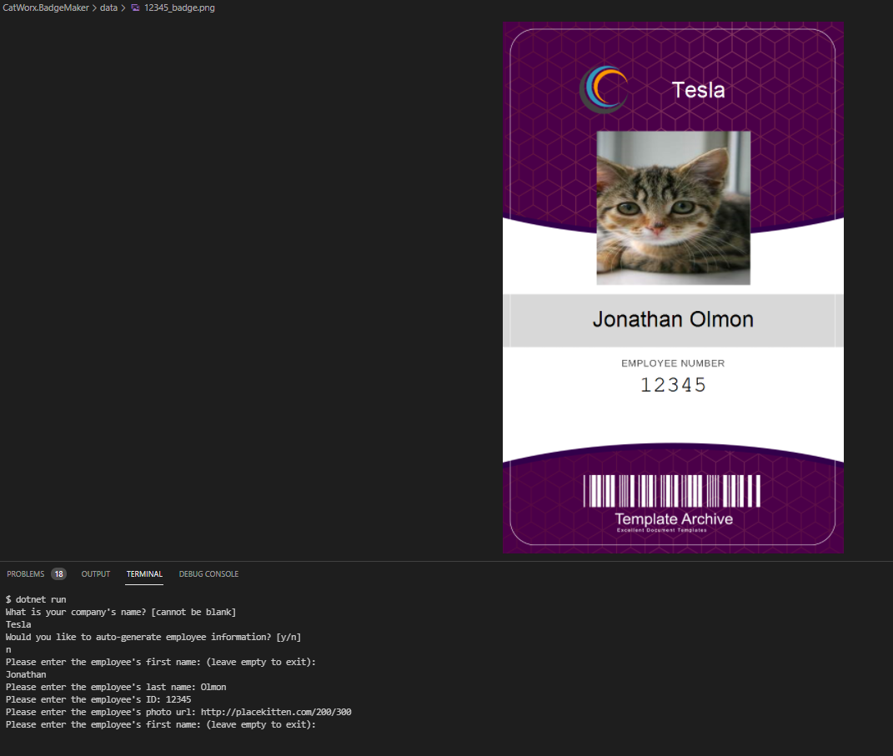

# C# : Badge Generator

## Purpose

The purpose of this project was to create an command line application using C# .NET that can take in information from the user and generate employee ID badges from it. 

Some features of the app are:

- When the user runs the script they are prompted to enter their companies name.
- Once the user has input the company name they are given the option to input the employee information themselves or auto generate the information. 
- Manual input: 
  - The user inputs a first name, last name, employee ID number, and photo url for any number of employees
  - Once the user is done inputting information the badges will be generated in the data directory, named based on the employee ID to avoid duplicate names causing an issue. 
- Random input: 
  - The application uses randomuser.me API to obtain information for ten employees. 
  - The application generates and stores the badges in the data directory, named based on the employee ID to avoid duplicate names causing an issue. 

A demo of the application can be found at: https://youtu.be/o4Apv8A_vjs

---

## Appearance
 

### * Here is an example of the application ran with API generated employee information:
 

 

### * Here is an example of the application ran with the employee information manually input:
 

